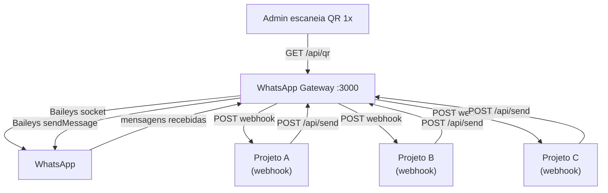

## Fluxo

1. **Setup**: Admin inicia o Gateway, escaneia o QR 1x
2. **Registro**: Cada projeto faz `POST /api/webhook` com sua URL e eventos
3. **Envio**: Projetos chamam `POST /api/send` com `{to, text}` → Gateway envia via Baileys
4. **Recebimento**: Mensagens que chegam → Gateway dispara webhooks para todos os projetos inscritos no evento `message`
5. **Resiliência**: Reconexão automática se cair (exceto loggedOut). Sessão persistida em `session/`
